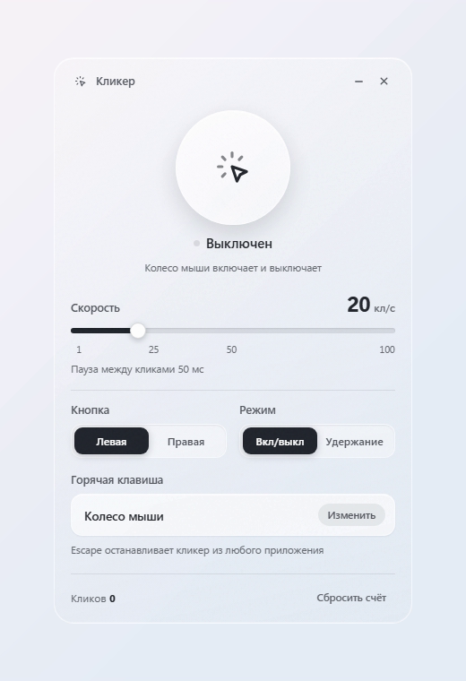
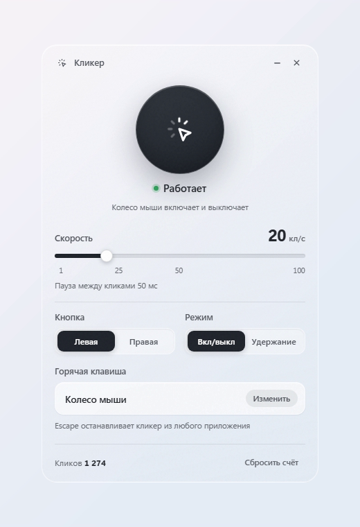

<div align="center">

# Кликер

Автокликер для Windows со стеклянным окном и плашкой поверх игр.
Одна горячая клавиша, скорость до 100 кликов в секунду, счёт кликов на виду.


</div>

## Плашка поверх всех окон

Кликер включают, не сворачивая игру, поэтому он сам сообщает о себе сверху по центру экрана. Плашка не перехватывает мышь и не забирает фокус: клики проходят сквозь неё.

| Включение | Работа | Итог захода |
|---|---|---|
|  |  |  |
| Карточка называет скорость и кнопку | Через полторы секунды карточка стягивается в пилюлю и считает клики вживую | На выключении пилюля разворачивается с итогом и уходит, сжимаясь |

## Окно

| Выключен | Работает |
|---|---|
|  |  |

Стекло — системный акрил Windows 11 плюс собственный слой, поэтому окно остаётся читаемым и там, где акрила нет.

## Что умеет

- Горячая клавиша по умолчанию — колесо мыши: нажали, кликер пошёл, нажали снова, остановился.
- Режим удержания: кликает, только пока кнопка зажата.
- Скорость от 1 до 100 кликов в секунду, ползунком, прямо во время работы.
- Клик левой или правой кнопкой.
- Любая клавиша или кнопка мыши на роль горячей, включая боковые кнопки игровых мышей.
- Escape останавливает кликер из любого приложения.
- Закрытие окна сворачивает кликер в трей, горячая клавиша продолжает работать.
- Счётчик кликов и настройки сохраняются между запусками.

## Запуск

Нужны Windows 10 или 11 и Node.js 20+.

```bash
npm install
npm start
```

Сборка установщика и переносимой версии:

```bash
npm run build
```

## Как устроено

- Electron 43 — два окна: настройки и плашка поверх всех окон (без рамки, прозрачная, сквозная для мыши).
- [koffi](https://github.com/Koromix/koffi) — прямые вызовы Win32: `SendInput` для кликов, `GetAsyncKeyState` для горячей клавиши, акрил и скругление углов, повышение точности таймера на время работы.
- Расписание кликов держит заданный темп и не «догоняет» пропущенное после подвисания системы, поэтому залпа кликов не бывает.
- Логика вынесена из Electron в `lib/`, поэтому покрыта обычными тестами.

```bash
npm test
```

## Лицензия

[MIT](LICENSE)
