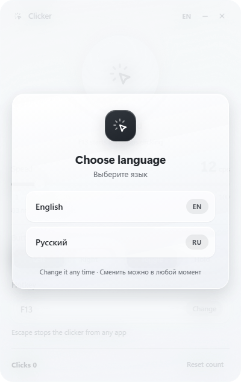

<div align="center">

**English** · [Русский](README.ru.md)

# Clicker

An autoclicker for Windows with a glass window and a notice that shows up over your game.
One hotkey, up to 100 clicks per second, the click count always in sight.


The same clicker for macOS lives in [mac](mac/README.md).

</div>

## The notice over every window

You turn the clicker on without leaving the game, so it announces itself at the top of the screen. The notice takes neither the mouse nor the focus: clicks pass right through it.

| Start | Running | Session result |
|---|---|---|
|  |  |  |
| The card names the speed and the button | After a second and a half the card shrinks into a pill and counts clicks live | On stop the pill expands with the result, then leaves by shrinking |

## The window

| Stopped | Running |
|---|---|
|  |  |

The glass is the Windows 11 system acrylic plus a layer of its own, so the window stays readable even where acrylic is unavailable.

## English and Russian



The first run asks which language to speak, and the answer is remembered. Everything switches together: the window, the notice over your game, the tray menu and the key names. The `EN` / `RU` button in the window header changes the language at any moment, even while the clicker runs.

## What it does

- The default hotkey is the mouse wheel: press once to start, press again to stop.
- Hold mode: clicks only while the button is held down.
- Speed from 1 to 100 clicks per second, on a slider, adjustable while running.
- Clicks with the left or the right mouse button.
- Any key or mouse button can become the hotkey, including the side buttons of gaming mice.
- Escape stops the clicker from any application.
- Closing the window hides the clicker to the tray, and the hotkey keeps working.
- The click counter and every setting survive a restart.

## Download

A ready build for Windows 10 and 11 is on the [releases page](https://github.com/feechkablum6/glass-clicker/releases/latest):

- `Klicker-Setup-1.1.0.exe` installs the clicker and puts a shortcut on the desktop.
- `Klicker-Portable-1.1.0.exe` runs from any folder, no installation needed.

The build carries no code signing certificate, so the first launch shows the blue SmartScreen window: pick "More info", then "Run anyway".

## Run from source

Windows 10 or 11 and Node.js 20+ are all you need.

```bash
npm install
npm start
```

Build the installer and the portable executable:

```bash
npm run build
```

## How it works

- Electron 43 with two windows: the settings window and the notice over everything else (frameless, transparent, click-through).
- [koffi](https://github.com/Koromix/koffi) calls Win32 directly: `SendInput` for clicks, `GetAsyncKeyState` for the hotkey, acrylic and rounded corners, a finer timer resolution while clicking.
- The click schedule keeps the requested pace and never catches up on clicks missed while the system stalled, so there is no burst afterwards.
- The logic lives in `lib/`, outside Electron, which is why plain tests cover it.

```bash
npm test
```

## License

[MIT](LICENSE)
